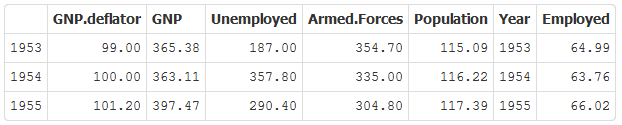

## Dataset in table form
* Presents the data in table form with customized subset of the variable to show and period of interest in years



* The app calculates an average proportion of employed for selected period
```{r}
# An average proportion of employed from 1954 to 1962
mean(longley$Employed[as.numeric(longley$Year)>1953])
```


